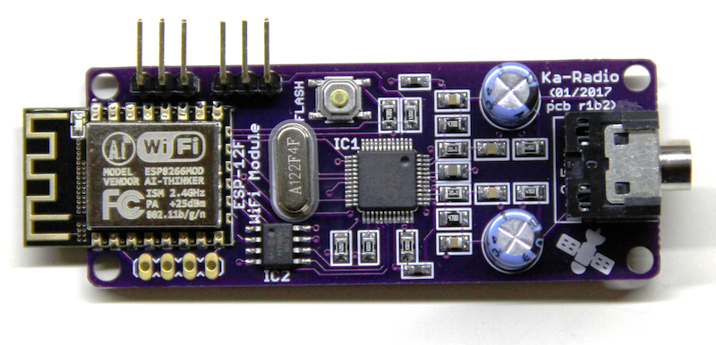
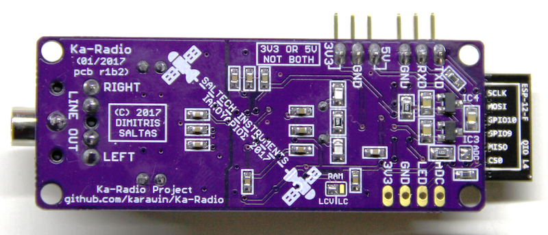

## WiFi WebRadio

This is a hardware project for [Ka-Radio](https://github.com/karawin/Ka-Radio).

It is based on [ESP8266](https://espressif.com/en/products/hardware/esp8266ex/overview) 
chip and audio codec [VS1053b](http://www.vlsi.fi/en/products/vs1053.html) chip.

### Features

- You can power it with 3V3 **or** 5V (5V can be from 4V to 6V). Do **NOT** use both power inputs at the same time.

- You can connect an external [keypad](https://github.com/karawin/Ka-Radio/blob/master/Hardware/controles.pdf) for control. Just unsolder the ADC jumper.

- The RXD pin is 5V tolerant so you can connect a 5V microcontroller.

- Output is line-out with large audio grade electrolytic capacitors. Safe to connect an external amplifier.

- You can use two types of SRAM. 23LCV1024 **or** 23LC1024. Just solder the proper jumper.

You can order the pcb from [OSH Park](https://oshpark.com/shared_projects/H0BeSd2u). <del>I also have a few boards assembled and tested to sell. E-mail for details</del>.
